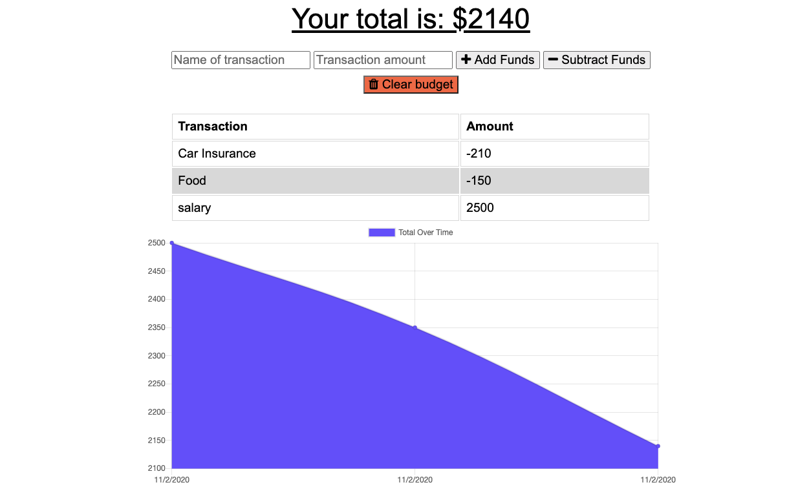

# Workout Tracker

## Description
It is a Progressive Web Application to track Budget without an internet connection. When the user inputs a withdrawal or deposit, that will be shown on the page, and added to their transaction history when their connection is back online. The app is downloadable on any device.  
## Table of contents
* [Description](#Description)
* [Link](#Link)
* [Usage](#Usage)
* [License](#License)
* [Contributing](#Contributing)
* [Screenshot](#Screenshot)
* [Questions](#Questions)
## Link
[Click here to view the deployed app](https://kk-budget-tracker.herokuapp.com/).
## Usage
Put the name of the transaction, then put the amout on the transaction amount area and click on `Add Funds` for a deposit or `Subtract Funds` for a withdrawal.

To download on computer, click on the plus `+` sign on the right side of the url field of the browser.  

For mobile devices, click [Here](https://mobilesyrup.com/2020/05/24/how-install-progressive-web-app-pwa-android-ios-pc-mac/) for more details.

## Licence
This app is under the MIT License.
## Contributing
I would be happy if anyone decide to improve it. All comments and suggestions are welcomed.
## Screenshot
 

## Questions
Contact me: kevkouadio@gmail.com

My Github: http://github.com/kevkouadio